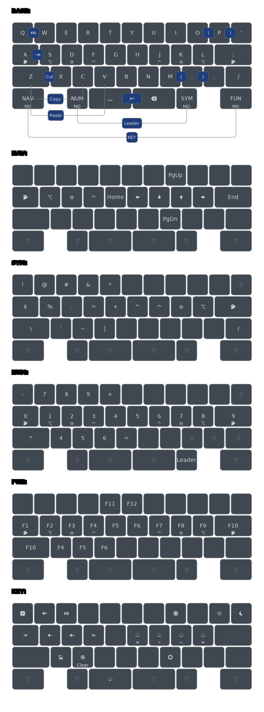

# Vault 35 Keymap

Leader keys macros:
- `leader wq` - `:w<ENTER>`
- `leader pa` - `()`
- `leader pi` - `()<LEFT>`
- `leader ba` - `{}`
- `leader bi` - `{}<LEFT>`
- `leader bsa` - `[]`
- `leader bsi` - `[]<LEFT>`
- `leader wq` - `:w<ENTER>`
- `leader e` - Macro `PERSONAL_EMAIL` defined in `emails.h`
- `leader wrk` - Macro `WORK_EMAIL` defined in `emails.h`
- `leader uni` - Macro `UNIVERSITY_EMAIL` defined in `emails.h`

